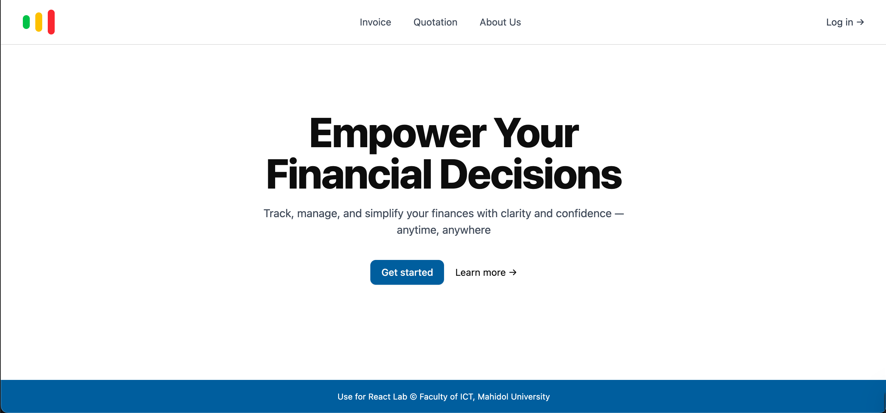
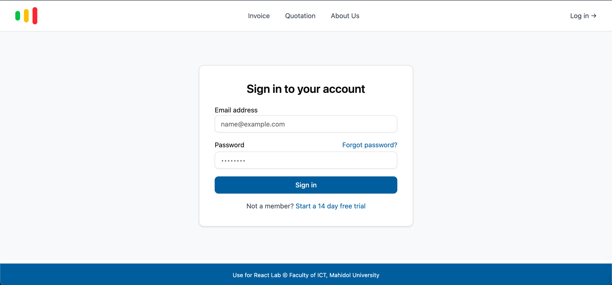

# Faculty of Information and Communication Technology <br/> ITCS257 Frontend Application Development <br/> Advanced React
The financial management system comprises three components: invoice, quotation, and receipt. Previously, the invoice management subsystem was built using HTML, CSS, and TypeScript. In this lab, you will implement the quotation management system using React, Tailwind CSS, React Hooks, and shadcn/ui.

## Objectives

After completing this lab, students will be able to:

- Implement a React application with multiple pages and components
- Connect frontend components to APIs using React Hooks
- Create custom hooks for specialized functionality
- Utilize shadcn/ui and Tailwind CSS for responsive user interfaces
- Implement form validation and data filtering features

## Exercise Tasks

Your task is to implement a simple Quotation Management System UI and connect it with APIs using React, Tailwind CSS, React Hooks, and shadcn/ui.

### Requirements

1. You need to implement the following functions:
    1. Home Page
    2. Login Page
    3. Quotation Page: This page should include functions to create, list, and search for quotations. The search function must support filtering by company name, client email, and date range (start and end creation dates). The quotation creation form must be validated for all fields.
    4. About Us Page: This page displays the system implementer's information in card format. The information must include first name, last name, email, and avatar.
    5. Logout function: you need to ensure that all tokens are deleted.
2. All functions must connect with the provided APIs.
3. You must use React, Tailwind CSS, React Hooks, and shadcn/ui to implement your system.
4. For React Hooks, you need to implement **at least three hooks** and **one custom hook**.
5. The design of your system should closely match the provided UI.

### System UI

Home Page



Login Page



Quotation Page


Create a Quotation


### Demo Video

The demo video also shows an invoice system. You may attempt to re-implement this system using React as an additional exercise, but this is optional and not required for completing the lab.

https://github.com/user-attachments/assets/b20efdf6-86f3-40cb-bd9b-3b115925c6fc


## Extra Tasks

Challenge yourself by implementing additional features to update and delete quotations.

## Submission

1. **Include a Generative AI usage declaration and reflection** at the beginning of your code file. Clearly state if AI tools were used and briefly reflect on your work.
2. **Push your code** to the provided GitHub Classroom repository for this assignment. Make sure all your code is committed and pushed before the submission deadline.
3. Submit the lab by the end of the next class session to the LAs. Late submissions may not be accepted.

## AI Usage Declaration and Reflection

Students must add an AI Declaration and a Reflection of Today's Learning to their MYREADME.md file.

A reflection is not a summary of what you did or what the AI generated.
Instead, it is a personal explanation of your learning process.

- If you used AI, focus on how AI impacted your learning or understanding of the code.
- If you did not use AI, focus on your learning, tools, and experience from the lab.

Here are examples:

### Example 1 – No AI Used

```tsx
/*
AI Declaration:
No Generative AI tools were used for this lab.
All code was written manually by the student.

Reflection:
[ Your Reflection goes here
Today’s lab helped me learn [key takeaway].
I practiced ...
]
*/

```

### Example 2 – AI Used for Reference

```tsx
/*
AI Declaration:
I used ChatGPT only to clarify HTML semantic tags.
No code was directly copied without modification.

Reflection:
[ Write 1–2 sentences reflecting on your learning or how AI impacted your understanding]
*/

```

### Example 3 – AI Assisted in Debugging

```tsx
/*
AI Declaration:
I used ChatGPT to help debug the table structure in my invoice layout.
I wrote all the other code, and I understand the entire implementation.

Reflection:
[ Write 1–2 sentences reflecting on your learning or how AI impacted your understanding ]
*/

```
